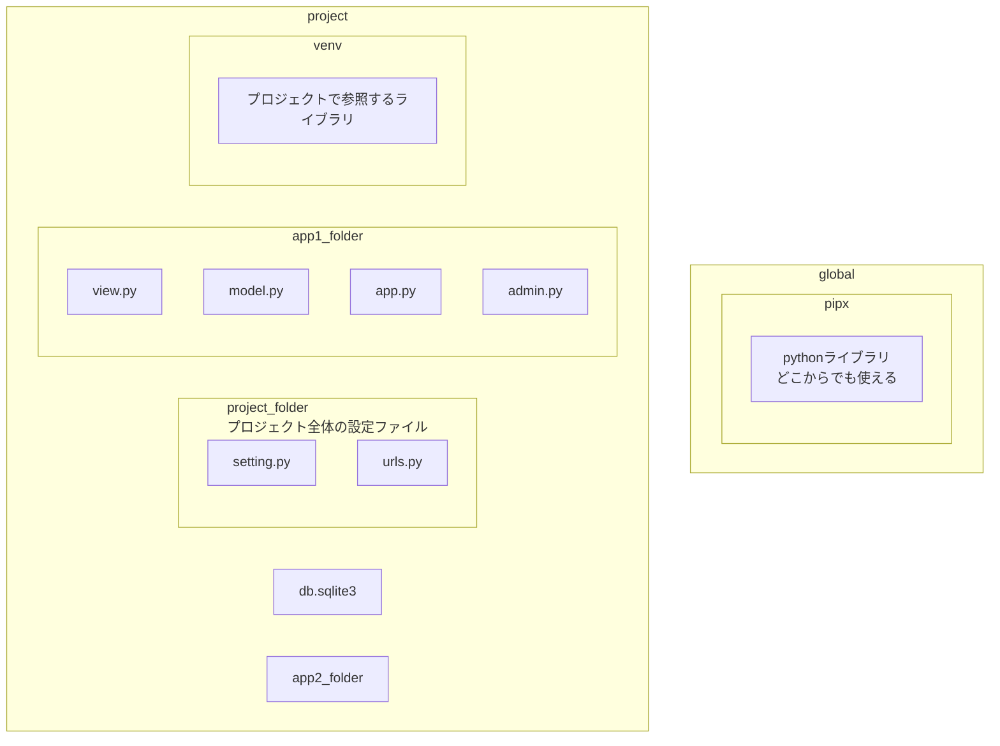

# Django入門

## 参考

kindle: 1時間でわかるPython Django基礎の基礎～入門者、初心者、挫折した人専用！～

※この本雑すぎる
　余裕があれば「1日で学ぶ！Django超入門: ー初心者でもブログサイトを作れるようになる本ー」の方が良い

[公式リファレンス](https://docs.djangoproject.com/ja/5.2/intro/tutorial01/)

## 構成図



## 注意

- やたら記事などで仮想環境が出てくるが仮想マシンを作成するわけではなくライブラリをフォルダ別にしてるだけである。
- pipxはpip3とほぼ同じだがグローバルかつライブラリごとに仮想環境を作ってインストールする。自動整形ツールやCLI専用のツールなどプロジェクトに直接使用しないものをインストールすることが推奨されている。

## 流れ

### 準備

まずはPythonが必要。

pip(~Python2.x)とpip3(Python3)で分かれているパッケージ管理ツール。

```
brew install python
brew install pip3
```

### プロジェクトフォルダを作る

-mはパッケージやモジュール(.py)を実行するオプション。インターフェイスオプションと呼ばれる。

```bash
# 開発用のフォルダを作成
mkdir ~/project_name; cd ~/project_name
# 仮想環境を作成し、アクティブに。djangoをインストール
python -m venv venv_name
source venv/bin/activate
pip install django
# djangoプロジェクトフォルダの作成
django-admin startproject config .
```

### プロジェクト
