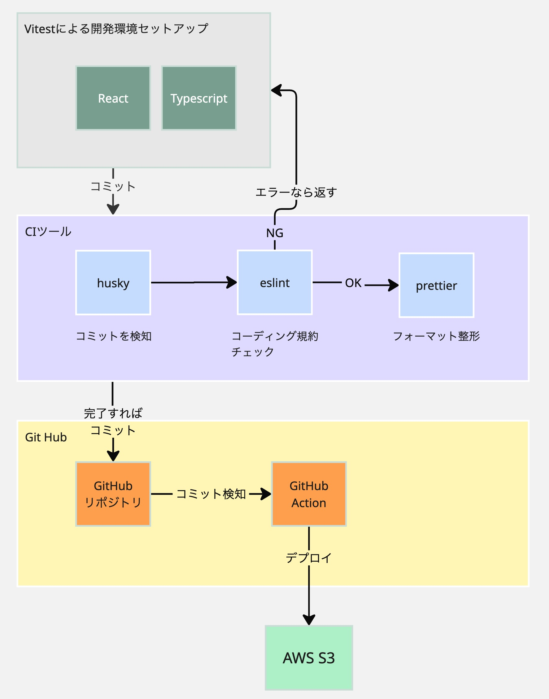

# オセロロードマップ

## 使用技術

1. フロントツール
   1. javascript
   2. typescript
   3. react
   4. Tailwind CSS
2. CIツール
   1. github
   2. husky [husky](https://pocket.co/share/c297c51e-e874-4435-adb1-cff3e15c6675)
   3. prettiter
   4. eslint
3. CDツール
   1. GitHub Action [GitHub Action 公式ドキュメント](https://docs.github.com/ja/actions)
   2. AWS S3

## 開発環境

1. viteによるプロジェクト作成

   - typescript
   - react
2. githubへの登録
3. コード品質ツール

   - husky
   - pretter
   - eslint
4. Tailwind CSSの導入
5. Vitestの導入
6. GitHub Actions AWS S3への静的ホスティング

## 概要図

## 参考URL

- [モダンなフロントエンド開発の基礎](https://zenn.dev/tmasuyama1114/books/react-setup-project/viewer/modern-frontend)
- [【図解解説】これ1本12分でReactのコンセプト全20種を理解できる教科書](https://qiita.com/Sicut_study/items/3247f55e8ae7992485e1?utm_source=pocket_shared)
