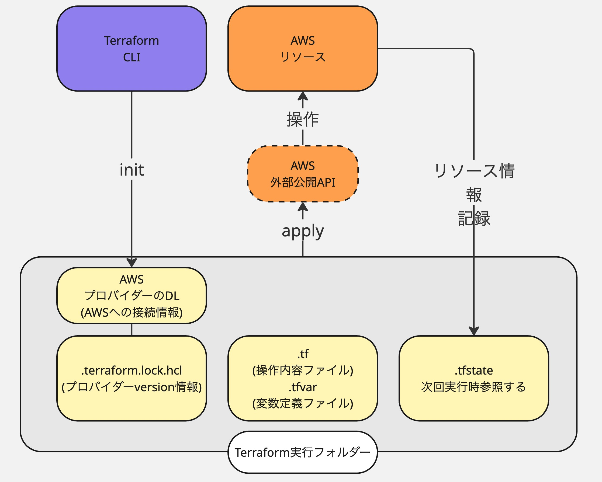

# Terraformでdocker runまで行う

## 目的

IaSを体験する。

ローカルからterraformを使用して、既存VPC内にEC2を作成しdokcerの実行までを行う。

稼働後該当IPにアクセスし、dockerコンテナ内のシステムにアクセスできることを確認する。

## 参考

[公式ドキュメント](https://developer.hashicorp.com/terraform/tutorials/aws-get-started/aws-build)

<details>
<summary><h2>目次</h2></summary>

- Terraformのバージョン管理ツールを入れる
- tenvのインストール tfenvとの比較
- terraformの安定バージョンインストール
- tfファイルを書く
- tfファイルの記法
- 実際書いたもの
- ファイル構成を再考する
- 定義ファイルに切り分ける
- コマンド操作部分を切り分ける
- 実行してみる

</details>

### 概要



参考：[Terraform プロバイダーについて](https://docs.aws.amazon.com/ja_jp/prescriptive-guidance/latest/getting-started-terraform/providers.html)

### Terraformのバージョン管理ツールを入れる

Terraformのバージョンを切り替えて実行ができるようバージョン管理ツールを入れる。

同様のツールにtfenvがメジャーだったが2023年に更新が止まっている。

後発のtenvを入れる。tenvからtfコマンドを実行することでバージョンを指定して実行が可能。

```
brew install tenv

tenv --version
```

### terraformのインストール

次にtenv経由でterraformをインストールする。

```
brew install tf
```

インストールできるリストの表示

```
tenv tf list-remote
```

特定バージョンのインストール

```
# 当時の安定バージョン
tenv tf install 1.11.4
```

インストールされたバージョン表示

```
tenv tf list
```

### tfコマンドとterraformコマンドの違い

tfコマンドはtenvやtfenvなどでを経由したコマンド。

主にinstallやdelete,useなどバージョン関連操作を行う。

terraformは実際のterraformの操作コマンド

### tfファイルを書く

まず、プロバイダー情報を指定する。

今回の場合はプロバイダーはAWSが外部公開しているAPIのバージョンのことを指す。

[リファレンス](https://registry.terraform.io/providers/hashicorp/aws/latest/docs/resources/instance)

各インスタンスのArgument Referenceやexampleをみよう。

```create_metabase.tf
# プロバイダー情報
provider "aws" {
  # ここにAWSのアクセスキーなどの認証情報を書くことができる
  # 今回はAWS CLIを用いている前提で記載はしない
  region = "us-east-1"
}

# サブネットの作成
resource "aws_subnet" "metabase-subnet" {
  vpc_id = "vpc-xxx"
  availability_zone = "us-east-1a"
  cidr_block = "xx.xx.xx.xx/xx"
  map_public_ip_on_launch = true
  tags = {
    Name = "metabase-subnet"
  }
}

# ルートテーブルをサブネットにアタッチ
resource "aws_route_table_association" "subnet_route_assoc" {
  subnet_id      = aws_subnet.meta-subnet.id
  route_table_id = "rtb-xxx" # 既存のRoute Table ID
}

# EC2の作成
# resource リソース対象名 terraform内部での名前
resource "aws_instance" "metabase-ec2" {
  ami           = "ami-0e449927258d45bc4"  # Amazon Linux 2023 arm
  instance_type = "t3.micro"
  availability_zone = "xxx"
  key_name = "key" # 既存のキーペア
  vpc_security_group_ids = ["sg-xxx"] # 既存のセキュリティグループ
  subnet_id     = "subnet-xxx" # 既存のサブネット
  associate_public_ip_address = true # これがないとIpv4割り当ててくれない
  user_data = <<-EOF
              #!/bin/bash
              yum update -y
              yum install docker -y
              service docker start
              usermod -a -G docker ec2-user
              docker run -d -p 3000:3000 --name metabase metabase/metabase
              EOF

  tags = {
    Name = "metabase"
  }
}

# 実行後ターミナルにipを表示する
output "metabase_public_ip" {
  value = aws_instance.metabase.public_ip
}

```

### 定義ファイルに切り分ける

tfファイルはvariable,localsによって変数宣言することができる。

variableは他ファイルの定義から注入可能な変数。

localsは定数宣言に近い。

以下は切り分け例。

```
# 変数定義 variables.tf
variable subnet_vpc {}
variable subnet_zone {}
variable subnet_cidr {}
variable route_table_id {}
variable ec2_ami {}
variable ec2_instance_type {}
variable ec2_security_group {}
#variable ec2_cmd_txt {}
```

```
# subnet  terraform.tfvars
subnet_vpc = "vpc-xxx"
subnet_zone = "us-east-1a"
subnet_cider = "xx.xx.xx.xx/xx"
# route table to subnet
route_table_id = "rtb-xxx"
# ec2
ec2_ami = "ami-0e449927258d45bc4"
ec2_instance_type = "t2.micro"
ec2_security_group = "sg-xxx"
```

一見変数を定義するだけなのに2ファイルに分けており意味がわからない。

しかし変数定義については上記では省略しているが以下の内容を定義することができる。

```
変数名 {
  type = "string" # 変数の型
  default = "vpc-xxx" # 定義なしの場合の値
  description = "これはvpcの説明です" # 注釈
}

```

つまり、データ型定義と代入部分に分けていると言える。

環境ごとに切り替える場合はtfvarsファイルを環境分作成することになる。

またterraformは実行時にファイルを指定することができる。

実行フォルダ以下のtfファイルは自動で読み込まれる。

```
terraform -var-file="meta-base.tfvars"
```

ファイル名を `terraform.tfvars`とすることでオプションなしで読み込んでくれる。

### 複数行のコマンド実行群の切り分け

tfvarsにはEOFなどの複数行の定義ができない。

tfファイル内に定義した結果が下の通り。

```
provider "aws" {
  region = "us-east-1"  # バージニア
}

resource "aws_subnet" "meta-subnet" {
  vpc_id = var.subnet_vpc
  availability_zone = var.subnet_zone
  cidr_block = var.subnet_cidr
  map_public_ip_on_launch = true
  tags = {
    Name = "metabase-subnet"
  }
}

resource "aws_route_table_association" "subnet_route_assoc" {
  subnet_id      = aws_subnet.meta-subnet.id
  route_table_id = var.route_table_id # 既存のRoute Table ID
}

resource "aws_instance" "metabase" {
  ami           = var.ec2_ami
  instance_type = var.ec2_instance_type
  key_name      = "key"     # ログイン用に使う既存のキーペア名
  subnet_id     = aws_subnet.meta-subnet.id
  vpc_security_group_ids = [var.ec2_security_group]# 80,22,3000インバウンド

  user_data = local.ec2_cmd_txt

  tags = {
    Name = "Metabase-Server"
  }
  associate_public_ip_address = true
}

output "metabase_public_ip" {
  value = aws_instance.metabase.public_ip
}

# ここでec2作成時のコマンドを移した
locals {
  ec2_cmd_txt = <<EOF
#!/bin/bash
sudo dnf update
sudo dnf install -y docker
sudo systemctl start docker
usermod -a -G docker ec2-user
docker run -d -p 3000:3000 --name metabase metabase/metabase
EOF
}
```

### 実行してみる

以降、上記ファイル群があるフォルダで実行する。

まずは以下コマンドでterraformから対応したプロバイダーをDLする。

プロバイダーは対象のリソースに繋ぐためのプラグインのようなもので、initコマンドによってDLや更新がなされる

```
terraform init
```

実行する前にチェックをする。

```
terraform plan
```

成功していれば実行する。`-auto-approve`は途中で聞かれる選択肢をyesにするもの。

` yum install -y`などの `-y`オプションに近い。

```
terraform apply -auto-approve
```

`tf plan`はコマンド実行フォルダ内の噛み合いをチェックする。

実際実行すると認証エラーやAWSリソース作成時のエラーなどは起こりえる。

実際にページにアクセスできれば成功。
